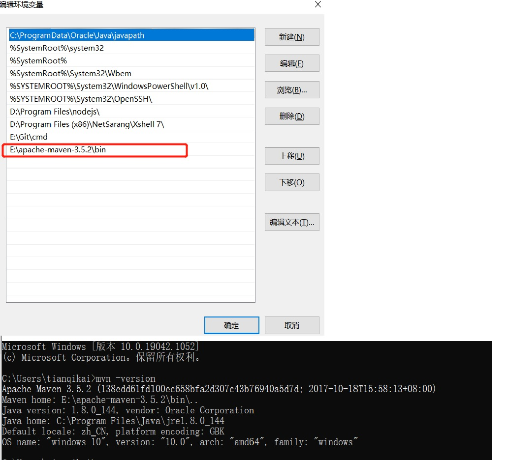
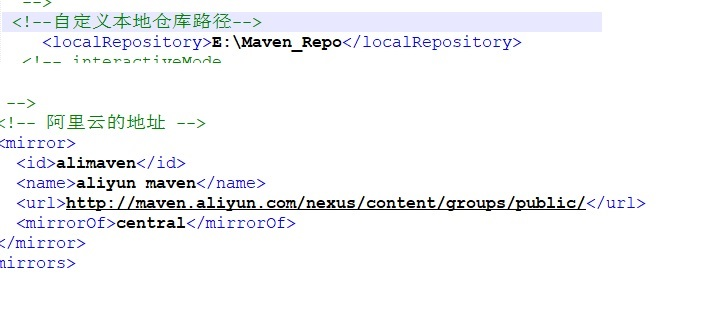
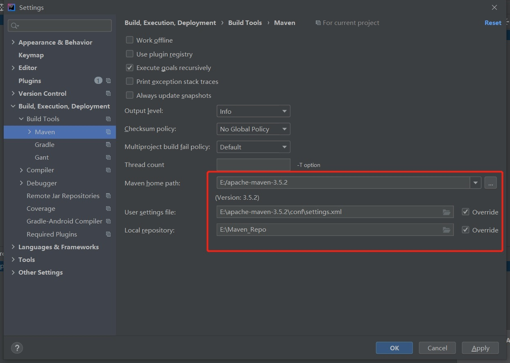

# 安装配置maven仓库

## 下载并安装

<a data-fancybox title="官方地址" href="http://maven.apache.org/download.cgi">官方下载地址:http://maven.apache.org/download.cgi</a> 

<a data-fancybox title="官方安装地址" href="http://maven.apache.org/install.html">官方安装地址:http://maven.apache.org/install.html</a> 

**下载之后直接解压即可**

## 配置环境变量(非必须)

 

## 配置本地仓库路径 和远程仓库路径

 

## idea配置maven

 

<a data-fancybox title="参考blog" href="https://blog.csdn.net/littlexiaoshuishui/article/details/89635357">参考Blog:https://blog.csdn.net/littlexiaoshuishui/article/details/89635357</a>
